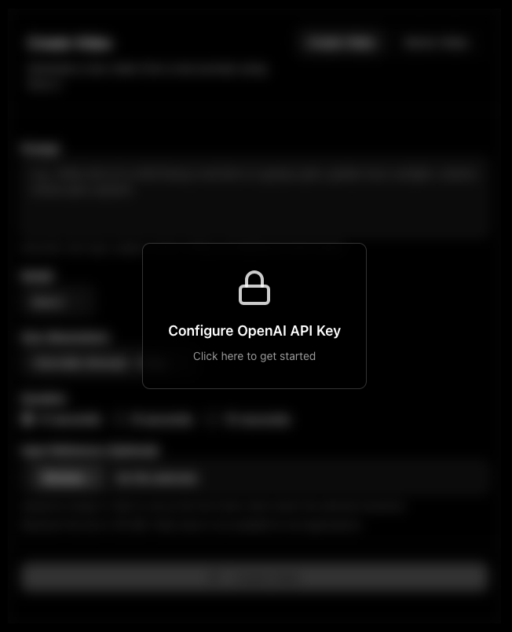
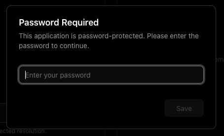

#  Sora 2 Playground

A web-based playground to interact with OpenAI's Sora 2 models for creating videos.


<p align="center">
  <a href="https://alasano.github.io/sora-2-playground/" style="font-size: 1.5em; font-weight: bold;">
    🚀 Try it Online
  </a>
  <br/>
  <em>No installation required, bring your own API key</em>
  <br/>
  <br/>
  • • •
</p>


<p align="center">
  
  <br/>
  <em>Main playground interface</em>
</p>

## 📚 Quick Links

- [🚀 Try it Online](https://alasano.github.io/sora-2-playground/) - Frontend-only mode
- [✨ Features](#-features)
- [🔀 Deployment Modes](#-deployment-modes)
- [🏠 Getting Started (Local)](#-getting-started-local-deployment)
- [▲ Deploy to Vercel](#-deploy-to-vercel)

## ✨ Features

*   **🎬 Video Creation Mode:** Generate new videos from text prompts using Sora 2 or Sora 2 Pro.
*   **🎨 Video Remix Mode:** Make targeted changes to existing videos with new prompts.
*   **⚙️ Full API Parameter Control:** Access and adjust all relevant parameters supported by the Sora 2 API directly through the UI (model selection, resolution, duration, optional input reference for first frame).
*   **🔄 Multi-Video Queuing:** Queue multiple videos for generation simultaneously - create as many videos as you want while others are processing.
*   **🔀 Two deployment modes:** backend (server API key) or frontend-only (user-supplied keys)

*   **📜 Detailed History & Cost Tracking:**
    *   View a comprehensive history of all your video generations and remixes.
    *   See the parameters used for each request (model, resolution, duration, prompt).
    *   Get detailed cost breakdowns (`$USD`) for each video. (hint: click the `$` amount on the video)
    *   Real-time progress tracking for videos currently being generated.
    *   Click any prompt to copy the full text.
    *   View total historical API cost.
    *   Delete individual videos from history (removes from local storage and OpenAI servers).
    *   Failed requests are tracked separately with error messages and excluded from cost calculations.

<p align="center">
  
  <br/>
  <em>Video history with cost tracking and status indicators</em>
</p>

<p align="center">
  
  <br/>
  <em>Detailed cost breakdown per video</em>
</p>

*   **🎥 Video Output Panel:** View generated videos with built-in player controls, progress slider, and playback controls.
*   **🚀 Send to Remix:** Quickly send any completed video (including remixes) to the remix form for further modifications.
*   **📥 Video Download:** Download generated videos directly to your device.
*   **💾 Storage:** Supports two modes via `NEXT_PUBLIC_FILE_STORAGE_MODE`:
    *   **Filesystem (default):** Videos saved to `./generated-videos` on the server (includes video, thumbnail, and spritesheet).
    *   **IndexedDB:** Videos saved directly in the browser's IndexedDB (ideal for serverless deployments like Vercel).
    *   Video history metadata is always saved in the browser's local storage.
    *   Active job IDs are persisted - resume polling automatically after page refresh.

## 🔀 Deployment Modes

This playground supports two deployment architectures depending on your needs:

| Feature | Backend Mode | Frontend Mode |
|---------|--------------|---------------|
| **OpenAI API Key Location** | Server-side (single shared key) | Client-side (user-supplied) |
| **Password Protection** | ✅ Supported via `APP_PASSWORD` | ❌ Not supported |
| **Storage** | Local disk or IndexedDB | IndexedDB only |
| **Build Output** | Dynamic (includes API routes) | Static HTML/CSS/JS export |
| **User Setup** | None (admin configures) | Each user provides their own API key |

**Backend Mode** is the default, ideal for personal use or team deployments where you control the API key.

**Frontend Mode** creates a static site that runs entirely in the browser, perfect for public deployments where each user brings their own API key.

<p align="center">
    
    <br/>
    <em>Frontend mode API key dialog</em>
  </p>

## 🚀 Getting Started [Local Deployment]

Follow these steps to get the playground running locally.

### Prerequisites

*   [Node.js](https://nodejs.org/) (Version 20 or later required)
*   [npm](https://www.npmjs.com/), [yarn](https://yarnpkg.com/), [pnpm](https://pnpm.io/), or [bun](https://bun.sh/)

### 1. Set Up API Key 🟢

You need an OpenAI API key to use this application.

⚠️ **Your OpenAI Organization needs access to Sora 2 API** - This is currently in limited beta. Check [OpenAI's documentation](https://platform.openai.com/docs) for availability.

**Quick start:** Rename `.env.local.example` to `.env.local` and update the values, or create a new `.env.local` file manually.

1.  If you don't have a `.env.local` file, create one (or rename `.env.local.example`).
2.  Add your OpenAI API key to the `.env.local` file:

    ```dotenv
    OPENAI_API_KEY=your_openai_api_key_here
    ```

    **Important:** Keep your API key secret. The `.env.local` file is included in `.gitignore` by default to prevent accidental commits.

<details>
<summary><b>🟡 Optional Environment Variables</b> (click to expand)</summary>

<br/>

#### Password Protection

Add password authentication to protect your local deployment:

```dotenv
APP_PASSWORD=your_password_here
```

When `APP_PASSWORD` is set, the application will prompt for authentication on page load. This prevents unauthorized access to your deployment.

<p align="center">
  
  <br/>
  <em>Password protection dialog (backend mode)</em>
</p>

#### Frontend-only Mode (Static)

Want to run everything purely in the browser and let each user supply their own API key? Enable frontend mode:

```dotenv
NEXT_PUBLIC_ENABLE_FRONTEND_MODE=true
```

- The UI switches to frontend mode and stores videos in IndexedDB automatically.
- The app password flow is disabled (there’s no secure way to enforce it client-side).
- Build the static site with:

  ```bash
  pnpm build:frontend
  ```

  This generates an `out/` directory that you can host on GitHub Pages, Netlify, S3, etc.
- Users will be prompted for their own OpenAI API key inside the browser—no server-side key required.

---

#### File Storage Mode

Configure where generated videos are stored:

```dotenv
NEXT_PUBLIC_FILE_STORAGE_MODE=fs  # or indexeddb
```

**Defaults:**
- **Local deployments:** `fs` (filesystem) - Videos saved to `./generated-videos` directory (includes video, thumbnail, and spritesheet files)
- **Vercel deployments:** `indexeddb` (browser storage) - Videos stored in your browser's IndexedDB

**Available modes:**
- **`fs` (filesystem):** Videos saved to the server's `./generated-videos` directory. Only works for local deployments or hosting with persistent filesystem.
- **`indexeddb` (browser storage):** Videos downloaded from OpenAI and stored in the browser's IndexedDB. Ideal for serverless/ephemeral environments.

**Important:** If you explicitly set `NEXT_PUBLIC_FILE_STORAGE_MODE=fs` on Vercel, it will be automatically overridden to `indexeddb` to prevent errors (Vercel's filesystem is read-only/ephemeral).

For local development, you can use either mode. If not set, the application auto-detects the environment.

---

#### Custom API Endpoint

If you need to use an OpenAI-compatible API endpoint (e.g., a local model server or a different provider), you can specify its base URL using the `OPENAI_API_BASE_URL` environment variable in your `.env.local` file:

```dotenv
OPENAI_API_KEY=your_openai_api_key_here
OPENAI_API_BASE_URL=your_compatible_api_endpoint_here
```

If `OPENAI_API_BASE_URL` is not set, the application will default to the standard OpenAI API endpoint.

</details>

---

### 2. Install Dependencies 🟢

Navigate to the project directory in your terminal and install the necessary packages:

```bash
npm install
# or
# yarn install
# or
# pnpm install
# or
# bun install
```

### 3. Run the Development Server 🟢

Start the Next.js development server:

```bash
npm run dev
# or
# yarn dev
# or
# pnpm dev
# or
# bun dev
```

### 4. Open the Playground 🟢

Open [http://localhost:3000](http://localhost:3000) in your web browser. You should now be able to use the Sora 2 Playground!

### 📦 Building a Static Frontend Bundle

If you enabled `NEXT_PUBLIC_ENABLE_FRONTEND_MODE`, produce a static export that you can host anywhere (S3, Netlify, GitHub Pages, etc.):

```bash
pnpm build:frontend
```

The compiled site will be available in the `out/` directory.

## ▲ Deploy to Vercel

Choose the deployment flavour that fits your use case:

#### Backend Mode (server-side API key)

[](https://vercel.com/new/clone?repository-url=https://github.com/alasano/sora-2-playground&env=OPENAI_API_KEY,APP_PASSWORD&envDescription=OPENAI_API_KEY%20required.%20APP_PASSWORD%20required%20during%20setup%20(protects%20public%20deployment%2C%20removable%20in%20settings%20afterward).&project-name=sora-2-playground&repository-name=sora-2-playground)

Store the OpenAI API key on the server and gate access with an optional password. (On Vercel the filesystem remains ephemeral, so videos still land in browser storage.)

#### Frontend-only Mode (static, user-supplied key)

[](https://vercel.com/new/clone?repository-url=https://github.com/alasano/sora-2-playground&env=NEXT_PUBLIC_ENABLE_FRONTEND_MODE&envDescription=Set%20NEXT_PUBLIC_ENABLE_FRONTEND_MODE%20to%20true%20so%20users%20provide%20their%20own%20OpenAI%20API%20key%20in%20browser.&project-name=sora-2-playground-frontend&repository-name=sora-2-playground-frontend)

Runs entirely in the browser. Each visitor pastes their own OpenAI API key, everything is stored in IndexedDB, and the build can be hosted as static assets.

### What Happens When You Deploy:

1. **Vercel clones this repository** to your GitHub account (creates a private repo by default)
2. **Deploys from the `master` branch** to a production URL
3. **You'll be prompted to enter** environment variables during setup
4. **Your deployment goes live** immediately after setup completes

### 🔒 Important Security Note:

**Production URLs on Vercel are public.** In backend mode an `APP_PASSWORD` is strongly recommended so random visitors can’t spend your API credits. Frontend mode doesn’t need (or support) password protection because the browser build can’t secure it.

### Environment Variables

**Backend mode** button prompts for:

- `OPENAI_API_KEY` *(required)* – stored server-side and used for all video operations.
- `APP_PASSWORD` *(required during setup)* – adds a password prompt to the UI. Remove it later in Vercel settings if you want the site open.

**Frontend mode** button prompts for:

- `NEXT_PUBLIC_ENABLE_FRONTEND_MODE` – set this to `true` during setup. No server-side API key is needed; users paste their own key in the browser.
- (Optional) you can also set `NEXT_PUBLIC_FILE_STORAGE_MODE=indexeddb`, but the app forces IndexedDB automatically when frontend mode is enabled.

### 🔐 Advanced: Protected Preview Deployments

If you want your deployment protected by Vercel team authentication instead of being publicly accessible:

1. **Create a new branch** in your GitHub repo (e.g., `production`):
   - Via GitHub UI: Branches → New branch
   - Or locally: `git checkout -b production && git push -u origin production`
2. **Go to Vercel:** Project Settings → Git → Production Branch
3. **Change** from `master` to `production`
4. **Result:**
   - Deployments from `master` branch → Preview deployments (requires Vercel login to access)
   - Deployments from `production` branch → Public production deployments

### Post-Deployment:

- Videos are automatically stored in your browser's IndexedDB (no server storage)
- Frontend mode prompts each visitor for their OpenAI API key; backend mode uses the server key you set during deployment
- You can add, modify, or remove environment variables anytime in Vercel Project Settings
- You can add a custom domain in Vercel Project Settings → Domains

## 🤝 Contributing

Contributions are welcome! Issues and feature requests, not as much welcome but I'll think about it.

## 📄 License

MIT
